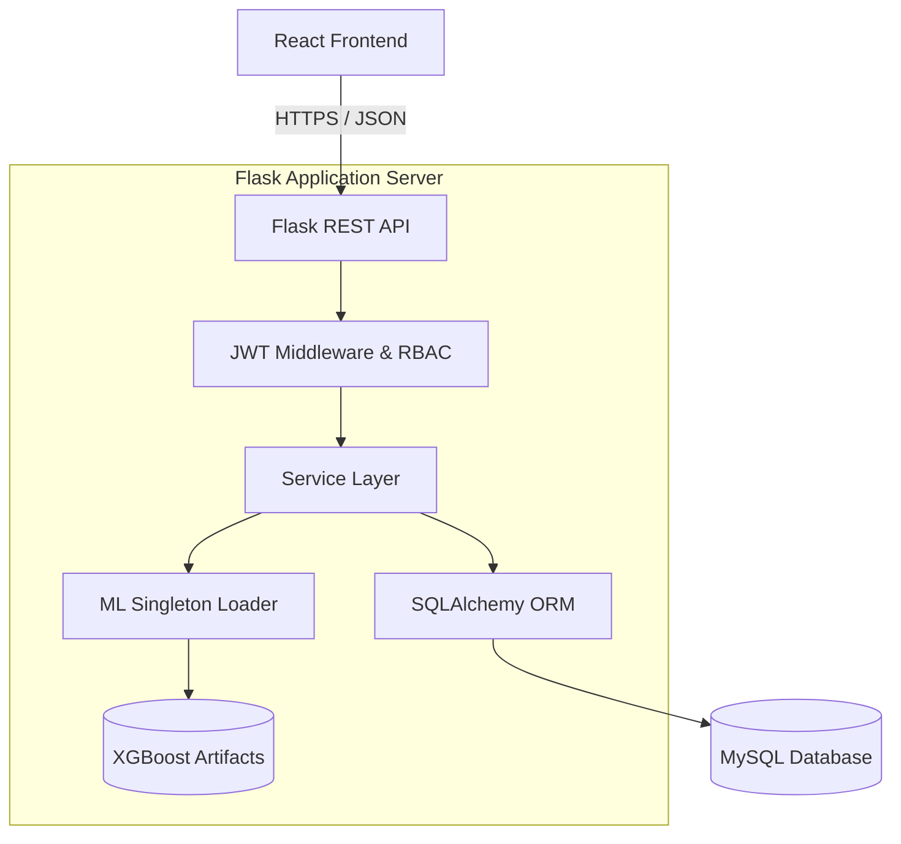
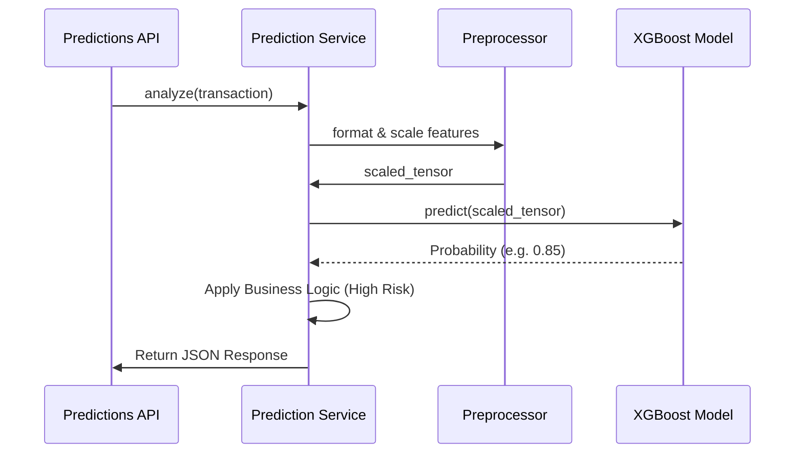

# System Architecture

The AI-Powered Fraud Detection System implements an Enterprise-grade 3-Tier Architecture.

---

## 1. Overall System Flow

## 2. Frontend Architecture (React + Vite)
- **Component-Driven**: UIs are constructed from reusable components (e.g., `RiskBadge`, `LoadingSkeleton`).
- **Context API**: Global state management for authentication (`AuthContext.jsx`).
- **Axios Interceptors**: The API service layer automatically injects JWT tokens into headers and intercepts `401` errors globally to redirect users to the login screen.
- **Routing**: `react-router-dom` handles client-side routing securely.

## 3. Backend Architecture (Flask)
We employ the **Application Factory Pattern** with **Blueprints**:
- `app/__init__.py`: Initializes the app, database, and JWT manager.
- `app/auth`, `app/predictions`, etc.: Blueprints encapsulate distinct domain logic.
- **Service Layer Pattern**: Controllers (`routes.py`) are thin. They parse requests and immediately pass data to `services.py`. This separation ensures business logic is testable independently of HTTP contexts.
- **Error Handling**: Custom exception handlers automatically format Python errors into standardized JSON responses (`{ status: "error", message: "..." }`).

## 4. Machine Learning Architecture

- **Thread-Safe Singleton**: The `ModelLoader` ensures the 85KB XGBoost model is only loaded from disk *once* when the server starts, preventing Memory/IO bottlenecks during concurrent API requests.

## 5. Database Flow (SQLAlchemy)
The system uses the Unit of Work pattern implicitly provided by SQLAlchemy sessions.
When a transaction is predicted as "High Risk":
1. `Transaction` is `add()`ed.
2. `Prediction` and `Explanations` are `add()`ed.
3. `Alert` and `ReviewCase` are `add()`ed.
4. `AuditLog` is `add()`ed.
5. `db.session.commit()` ensures atomicity. If any step fails, the entire block rolls back, preventing orphaned alerts.
